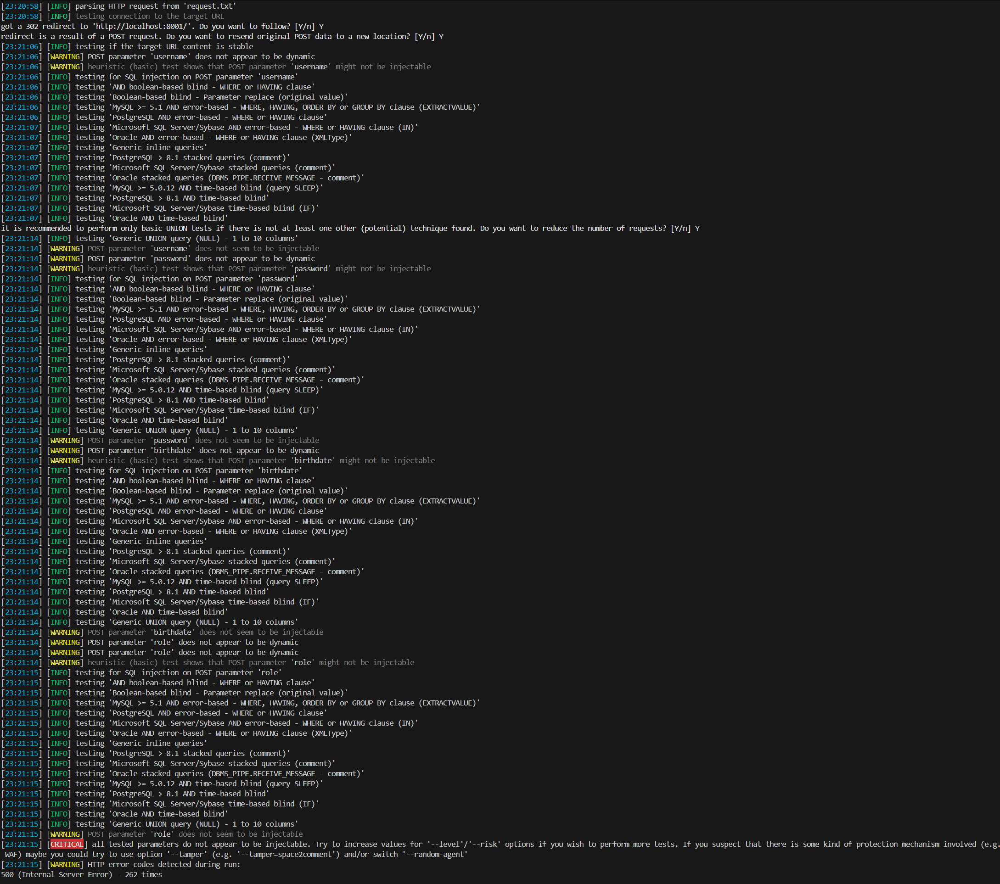

# 1️⃣ Introduction

**Tester(s):**  
- Name: Joni Sillanpää 

**Purpose:**  
- To asses web application weaknesses such as injection flaws and improper handling of user input.

**Scope:**  
- Tested components: GET & POST requests, Form submissions, Headers and error handling
- Exclusions:  
- Test approach: White-Box

**Test environment & dates:**  
- Start:  21:02
- End:  21:03
- Test environment details (OS, runtime, DB, browsers): Windows 11, Burp, PostgreSQL, Firefox, Chromium

**Assumptions & constraints:**  
- e.g., credentials provided, limited time, etc.
- The application was made to have obvious weaknesses on purpose for the sake of this exercise.

---

# 2️⃣ Executive Summary

**Short summary (1-2 sentences):**  

**Overall risk level:** (Low / Medium / High / Critical)

**Top 5 immediate actions:**  
1.  Use an "accept known good" input validation strategy
2.  Check all data on server side
3.  Implement unpredictable CSRF per session tokens
4.  Set Content Security Policy (CSP) Header
5.  Deny the usage of iframe

---

# 3️⃣ Severity scale & definitions

|  **Severity Level**  | **Description**                                                                                                              | **Recommended Action**           |
| -------------------- | ---------------------------------------------------------------------------------------------------------------------------- | -------------------------------- |
|     🔴 **High**      | Path Traversal.                                                                                                              | *Immediate fix required*         |
|     🔴 **High**      | SQL Injection.                                                                                                               | *Immediate fix required*         |
|     🟠 **Medium**    | Absence of Anti-CSRF Tokens.                                                                                                 | *Immediate fix required*         |
|     🟠 **Medium**    | Content Security Policy (CSP) Header Not Set.                                                                                | *Fix ASAP*                       |
|     🟠 **Medium**    | Missing Anti-Clickjacking Header.                                                                                            | *Fix soon*                       |
|     🟡 **Low**       | Application Error Disclosure.                                                                                                | *Monitor and fix in maintenance* |
|     🟡 **Low**       | X-Content-Type-Options Header Missing.                                                                                       | *Monitor and fix in maintenance* |

---

# 4️⃣ Findings (filled with examples → replace)

> Fill in one row per finding. Focus on clarity and the most important issues.

| ID | Severity | Finding | Description | Evidence / Proof |
|------|-----------|----------|--------------|------------------|
| F-01 | 🔴 High | Vulnerable to Path Traversal attack | An attacker may manipulate a URL in such a way that the web site will execute or reveal the contents  |  |
| F-02 | 🔴 High | SQL Injection might be possible | The page results were successfully manipulated using the boolean conditions |  |
| F-03 | 🟠 Medium | Absence of Anti-CSRF Tokens | No Anti-CSRF tokens were found in a HTML submission form | <form action="/register" method="POST"> |
| F-04 | 🟠 Medium | Content Security Policy (CSP) Header Not Set | Not safe against XSS and data injection attacks |  |
| F-05 | 🟠 Medium | Missing Anti-clickjacking Header | The response does not protect against 'ClickJacking' attacks |  |
| F-06 | 🟡 Low | Application Error Disclosure | This page contains an error/warning message that may disclose sensitive information | HTTP/1.1 500 Internal Server Error |
| F-07 | 🟡 Low | X-Content-Type-Options Header Missing | The Anti-MIME-Sniffing header X-Content-Type-Options was not set to 'nosniff' |  |

---

> [!NOTE]
> Include up to 5 findings total.   
> Keep each description short and clear.

---

# 5️⃣ OWASP ZAP Test Report (Attachment)

**Purpose:**  
- Attach or link your OWASP ZAP scan results (Markdown format preferred).

---

**Instructions:**
1. Check lecture recordings
2. Save the report as `zap_report_round1.md` and link it below.

---
> [!NOTE]
> 📁 **Attach full report:** → `check itslearning` → **Add a link here**

---
